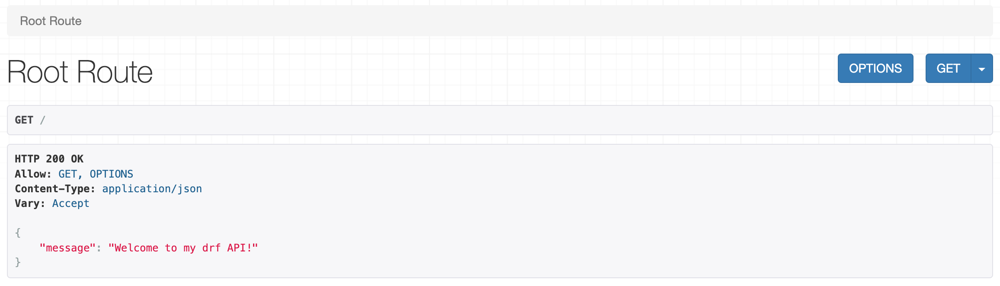

# rem-backend
REM is an application created for me and others to make notes about code snippets and other useful command strings. It's possible for anyone to create their own notes and also to pin their own or others' notes. I took inspiration from the movie 'Matrix' for the choice of the color scheme." The backend functionality is built on Django using Django REST Framework with a Postgres SQL database. The frontend is a React application that uses the React library Axios to connect with the Api. Issues in Github rem-frontend repository is used to handle what features to build and prioritise according to the MoSCoW method. 

The live link for the frontend (Web application) can be found here - [https://rem-front-378d7413a299.herokuapp.com/](https://rem-front-378d7413a299.herokuapp.com/)  
The live link for the backend (Web API) can be found here - [https://rem-backend-api-933e70f9f3d2.herokuapp.com/](https://rem-backend-api-933e70f9f3d2.herokuapp.com/)  

# Testing

Steps | Expected result | Actual Results | Pass / Fail
------------- | ------------- | ------------- | -------------
|||| As expected | Pass 
Append uri /profiles | List profiles data | As expected| Pass
Append uri /profiles/2| Fetch profile by id | As expected| Pass
Append uri /profiles/66| Error message: "HTTP 404 Not Found" "detail": "Not found."  | As expected| Pass
Login| Django REST framework login page should open | As expected| Pass
Logged in as admin| Form to update admin's own profile should open | As expected| Pass
Logout| Form to update admin's own profile should not open | As expected| Pass
Append uri /notes | List notes list | As expected| Pass
Append uri /notes/2| Fetch a note by id| As expected| Pass
Append uri /comments| Fetch comments list| As expected| Pass
Append uri /comments/7| Fetch comments by id| As expected| Pass
Append uri /pins| Fetch pins list | As expected| Pass
Append uri /pins/4| Fetch a pin by id| As expected| Pass

[Test_Api](assets/file/TestResultsImages.md)

# Bugs

# Deployment
The Django project Remember-backend is deployed on Heroku cloud service from Github repository rem-backend https://github.com/SamsKod/rem-backend/. A Postgres database on ElephantSQL cloud service is used and media files is handled by cloud service Cloudinary.

Steps to deploy it on Heroku:

* Fork this Github repository
* Create accounts at Heroku, ElephantSQL and Cloudinary Cloud services.
* Create a new instance in ElephantSQL ( you can use the free Tiny Turtle plan)
* Copy your ElephantSQL database url. You find it on the dashboard.
* Create a new app in Heroku
  * Open settings tab. Click Reveal Config Vars.
  * Add Config Var: DATABASE_URL with Value of your ElephantSQL database url.
  * Add Config Var: CLOUDINARY_URL with Value of your Cloudinary API Enviroment variable you find on the Cloudinary dashboard.
  * Add Config Var: SECRET_KEY with random value you create. 
  * Add Config Var: DISABLE_COLLECTSTATIC with Value 1 .
* In Heroku App settings page you select Deployment Method Github and connect to your Github repository where you have copied the code and deploy by clicking Deploy Branch.

Steps on local:

* Fork this Github repository and clone it to local
* Create account on Cloudinary Cloud services to handle file storage.
* Create a env.py file in rem-backend folder with this settings.
  - import os
  - os.environ['CLOUDINARY_URL'] = 'cloudinary://your_cloudinary_url'
  - os.environ['DEV'] = '1'
  - os.environ.setdefault("SECRET_KEY", "create_your_own_secret_key")

* In terminal/console:
  * Go to backend folder and run pip install -r requirements.txt
  * run python manage runserver

# Credits
Example code and design is used from:
- Code Institute
- Django Rest Framework

# Media
My photos.

